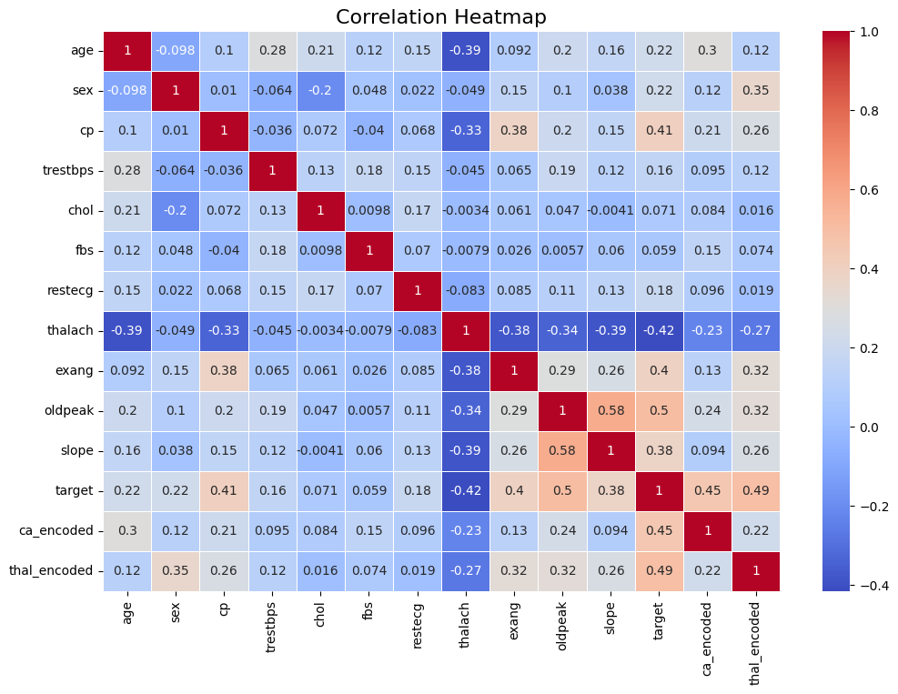
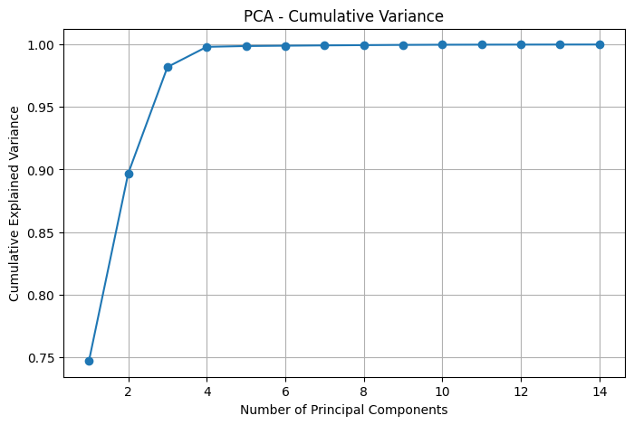
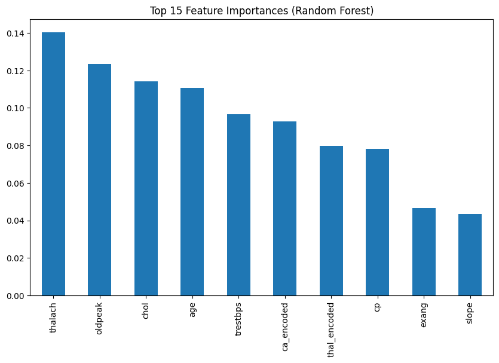
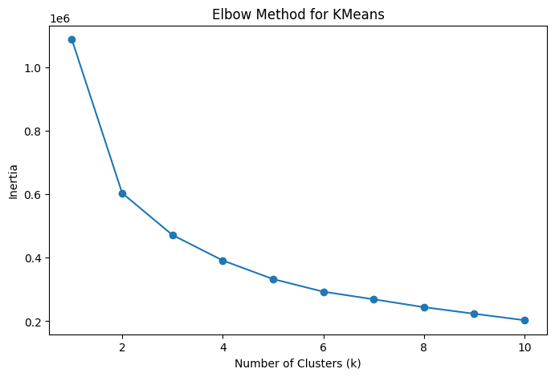
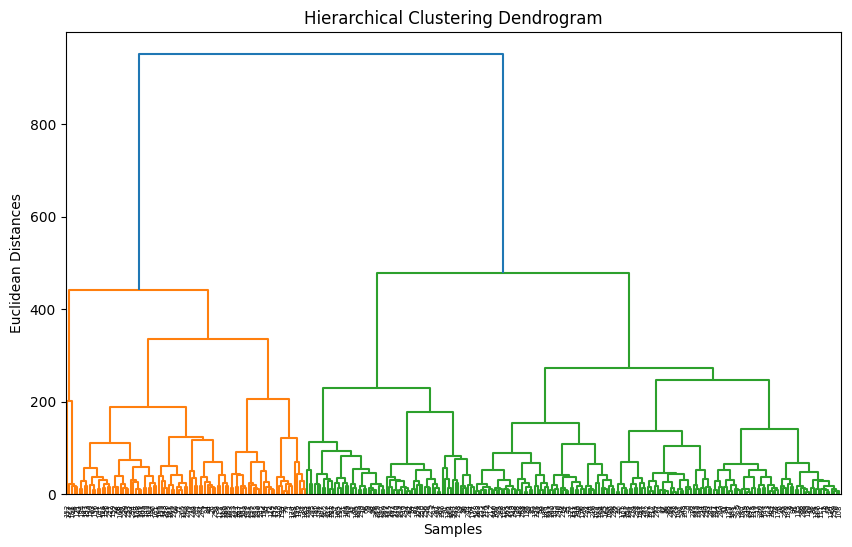

# ❤️ Heart Disease Prediction — Comprehensive ML Pipeline  

 <!-- 🔹 Replace with your banner -->

## 📌 Project Overview  
This project implements a **full machine learning pipeline** on the **UCI Heart Disease Dataset**.  
The goal is to predict whether a person is at risk of heart disease based on their health indicators.  

We cover:  
- Data preprocessing & cleaning  
- Feature selection & dimensionality reduction  
- Supervised & unsupervised learning  
- Hyperparameter tuning  
- Model deployment with **Streamlit + Ngrok**  

---

## 🎯 Objectives  
- Preprocess and clean raw medical data.  
- Select the most important features using statistical & ML-based methods.  
- Train and evaluate multiple classification models.  
- Explore unsupervised learning techniques.  
- Deploy a **Streamlit web UI** for real-time predictions.  

---

## 🛠 Tools & Libraries  
- **Languages:** Python  
- **Data Processing:** Pandas, NumPy  
- **Visualization:** Matplotlib, Seaborn  
- **ML & Stats:** Scikit-learn, XGBoost  
- **Deployment:** Streamlit, Ngrok  
- **Version Control:** GitHub  

---

## 📊 Dataset  
We use the [UCI Heart Disease Dataset](https://archive.ics.uci.edu/ml/datasets/heart+disease).  

- **Target:** Presence of heart disease (`1 = disease`, `0 = no disease`).  
- **Features:** Age, sex, chest pain type, blood pressure, cholesterol, fasting blood sugar, max heart rate, ST depression, slope, ca, thal, etc.  

📌 Example snapshot:  


---

## 🔄 ML Pipeline  

### 1️⃣ Data Preprocessing & Cleaning  
- Handle missing values with `SimpleImputer`.  
- Encode categorical variables (`OneHotEncoder`).  
- Scale features with `StandardScaler`.  
- EDA: histograms, correlation heatmaps, boxplots.  

📌 Example correlation heatmap:  


---

### 2️⃣ Dimensionality Reduction (PCA)  
- Applied PCA to reduce dimensionality.  
- Visualized explained variance ratio.  

📌 PCA Variance Explained:  


---

### 3️⃣ Feature Selection  
- **Feature Importance:** Random Forest / XGBoost.  
- **Recursive Feature Elimination (RFE).**  
- **Chi-Square Test** for categorical significance.  
- Selected final set of 10–11 predictors.  

📌 Example feature importance plot:  


---

### 4️⃣ Supervised Learning  
Models trained:  
- Logistic Regression  
- Decision Tree  
- Random Forest  
- SVM  

Evaluation metrics: Accuracy, Precision, Recall, F1, ROC-AUC.  

📌 Example Confusion Matrix:  


📌 Example ROC Curve:  


---

### 5️⃣ Unsupervised Learning  
- **K-Means Clustering** (Elbow Method to find k).  
- **Hierarchical Clustering** (Dendrogram analysis).  

📌 Example K-Means elbow curve:  


📌 Example dendrogram:  


---

### 6️⃣ Hyperparameter Tuning  
- Used `GridSearchCV` & `RandomizedSearchCV` to optimize models.  
- Best model: **Random Forest Classifier**.  

---

### 7️⃣ Model Export  
- Final optimized model saved as:  
  ```bash
  models/final_model.pkl